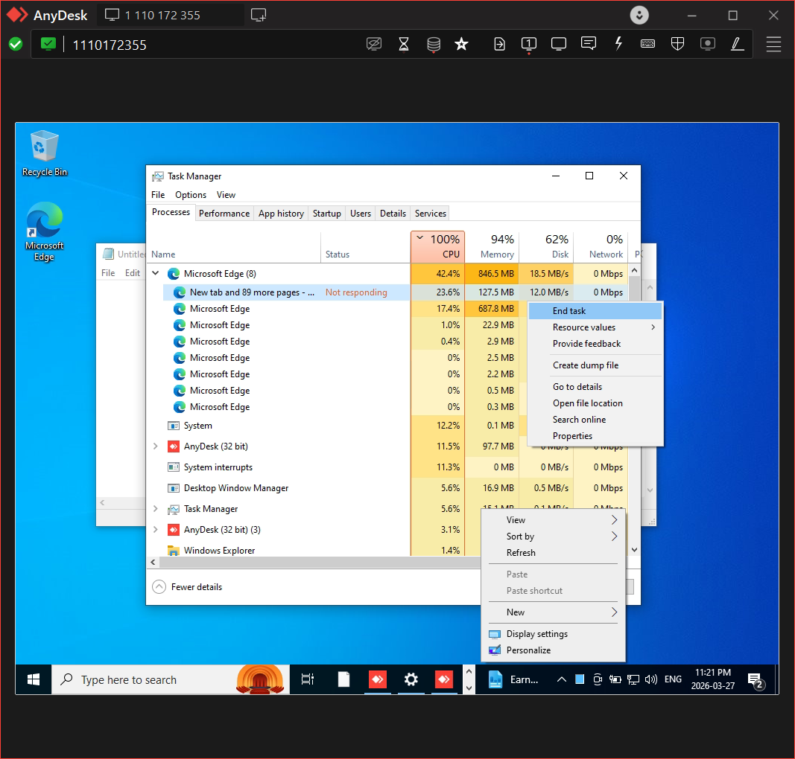

# Remote Troubleshooting – Application Not Responding

## Problem
User reported that an application was not responding.

## Environment
Remote system accessed using AnyDesk

## Diagnosis
- Connected remotely
- Opened Task Manager
- Identified application in "Not Responding" state

## Root Cause
Application crash due to high memory usage

## Resolution
- Ended task using Task Manager
- Restarted the application

## Result
Application resumed normal functionality

## Tools Used
- AnyDesk
- Task Manager

