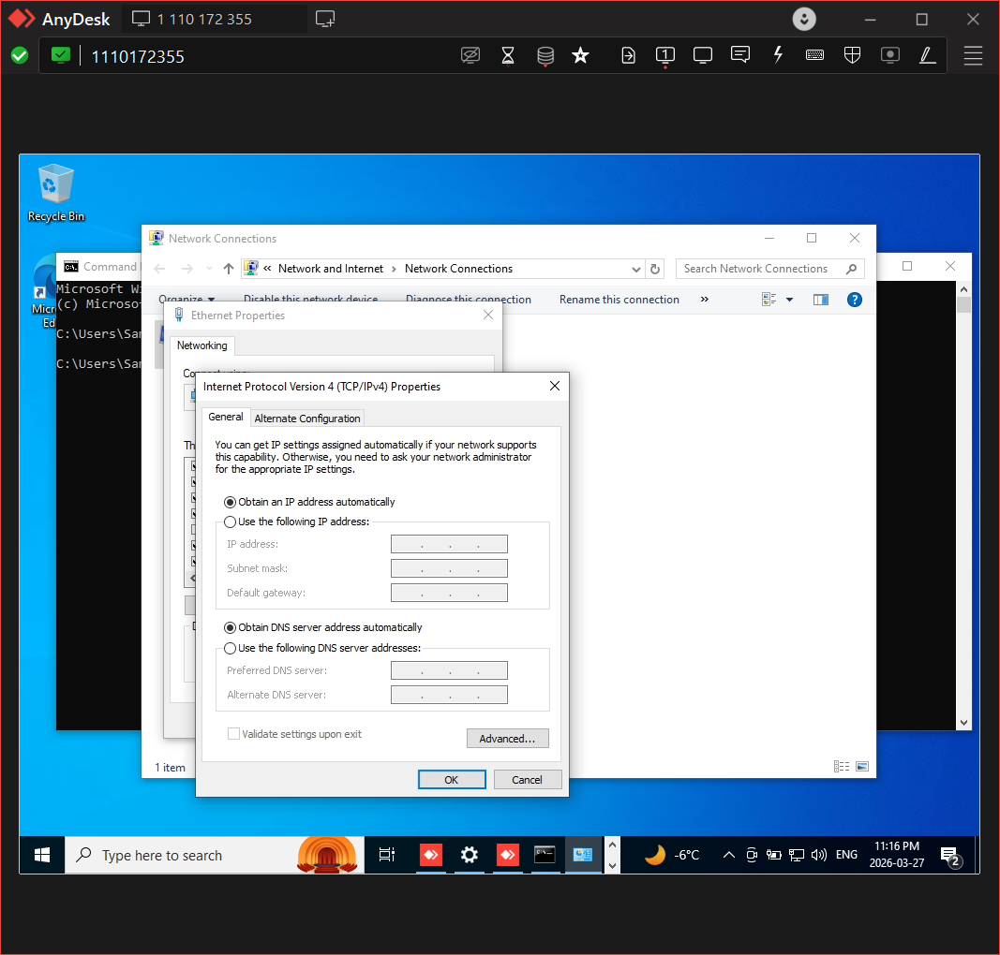
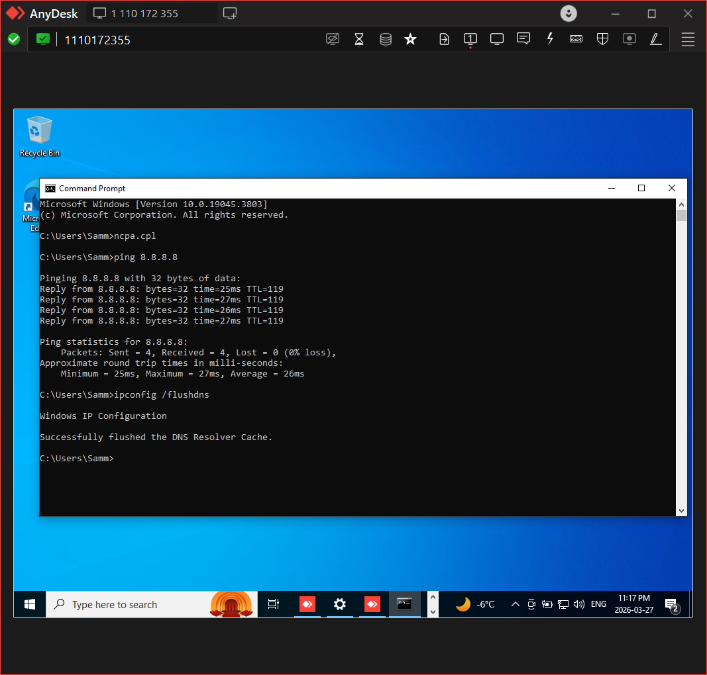

# Remote Troubleshooting – No Internet (DNS Issue)

## Problem
User was unable to access websites despite being connected to the network.

## Environment
Remote system accessed using AnyDesk

## Diagnosis
- Ran ping 8.8.8.8 → success
- Ran ping google.com → failed

## Root Cause
DNS resolution failure

## Resolution
- Updated DNS server to 8.8.8.8
- Flushed DNS cache using ipconfig /flushdns

## Result
Internet access restored successfully

## Tools Used
- AnyDesk
- Command Prompt

