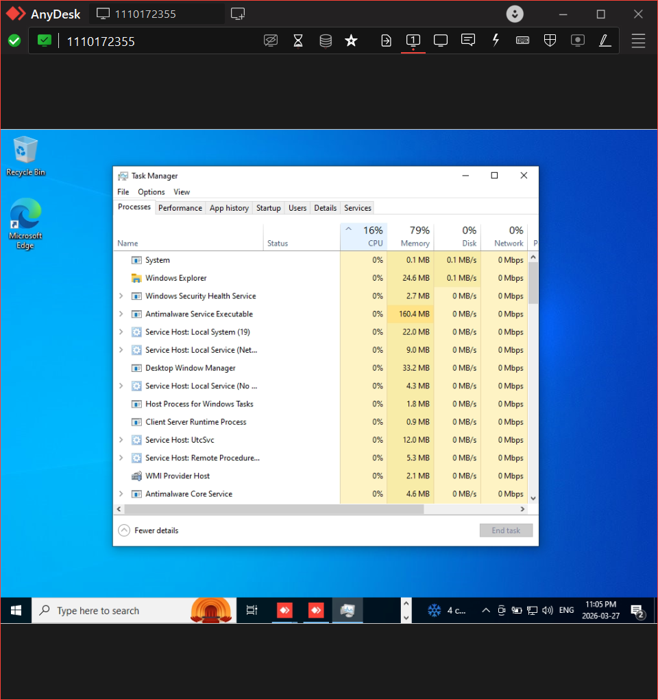
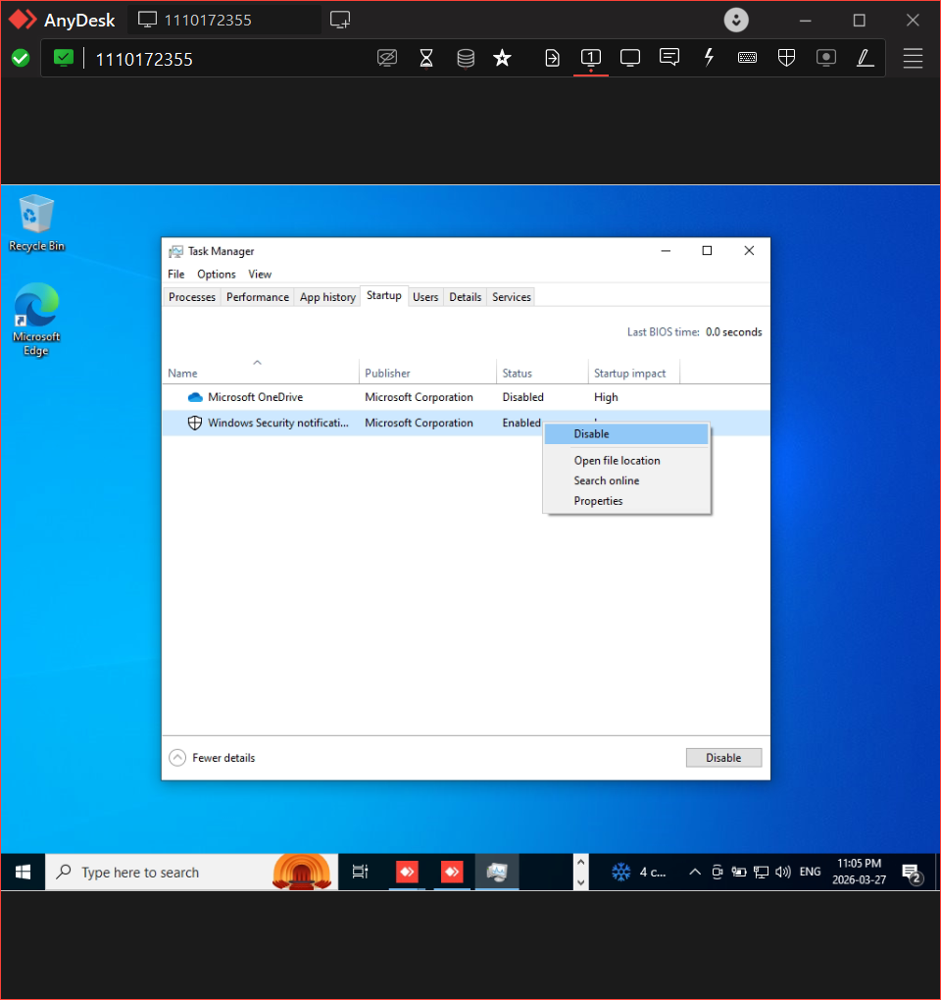

# Remote Troubleshooting – Slow System

## Problem
User reported that their system was running very slow.

## Environment
Remote system accessed using AnyDesk

## Diagnosis
- Connected remotely using AnyDesk
- Opened Task Manager
- Observed high CPU and memory usage

## Root Cause
Multiple background applications consuming system resources

## Resolution
- Closed unnecessary applications
- Disabled startup programs

## Result
System performance improved significantly

## Tools Used
- AnyDesk
- Task Manager

